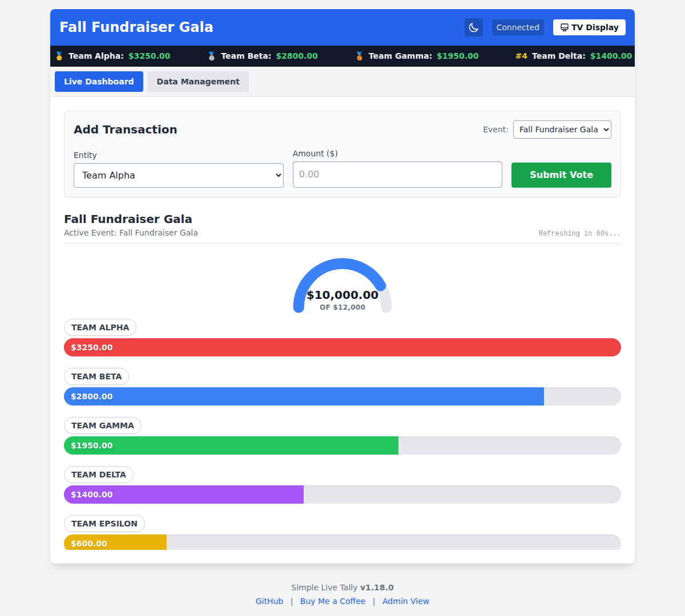
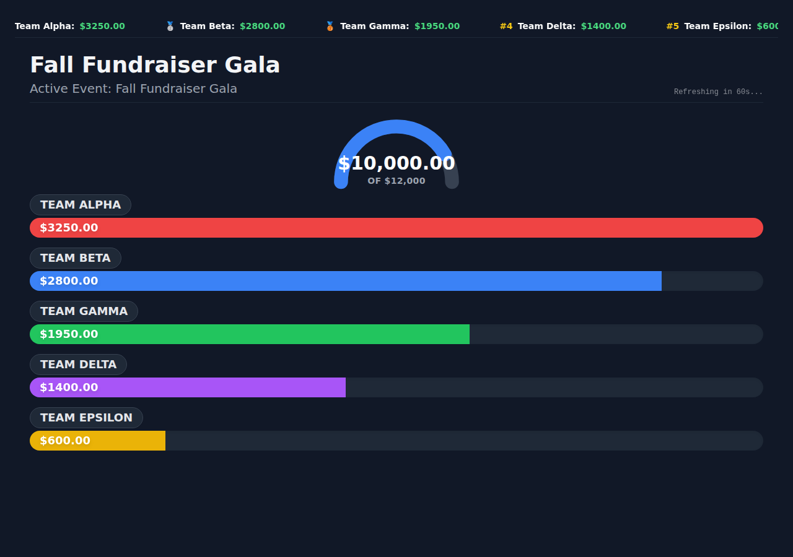
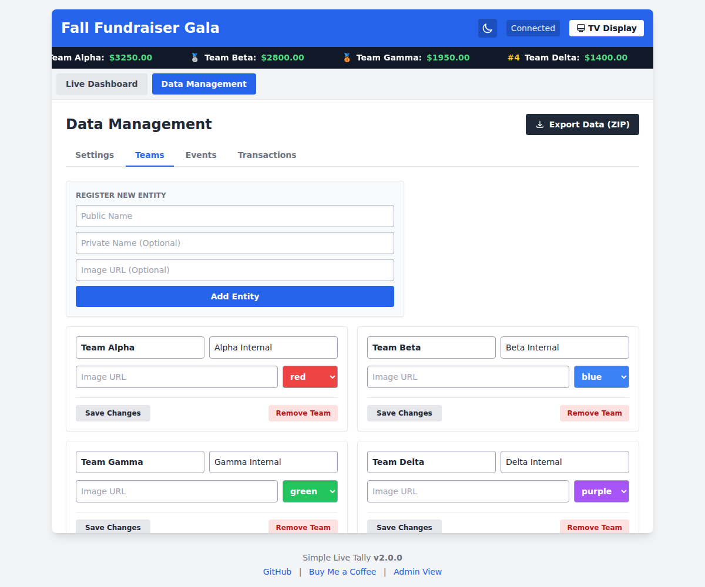

# Simple Live Tally

[](https://www.buymeacoffee.com/adambeltz)

**Simple Live Tally** is a serverless, near real-time fundraising and voting display web application designed for live events. It uses a **Bring-Your-Own-Storage (BYOS)** architecture, running entirely as a static site on GitHub Pages and storing all data securely inside your own personal Dropbox account using an App Folder.

---

## Try It Live — No Setup Required

You don't need to fork, clone, or deploy anything to use this. The app is already hosted at:

### **[adambeltz2.github.io/Simple-Live-Tally](https://adambeltz2.github.io/Simple-Live-Tally/)**

Just open that page and sign in with **your own** Dropbox account. Because of the BYOS design, the hosted copy has no shared backend or database — every visitor authenticates individually, and each person's event data is written only to a private `/Apps/Simple Live Tally/` folder inside *their own* Dropbox. Nobody else (including the person who runs this GitHub page) can see or touch it. You only need your own copy of this repository if you want to customize the branding/code or host it under your own domain — see [Quick Start & Deployment Guide](#quick-start--deployment-guide) below for that.

---

## Screenshots

**Live Dashboard** — the leaderboard operators and guests watch update in real time, with an animated goal gauge and per-team progress bars.



**TV / Projector Display Mode** — append `#tv` to the URL for a high-contrast, full-bleed layout built for 1080p screens.



**Data Management** — add/edit teams, events, and transactions from dedicated sub-tabs instead of one long scrolling page.



---

## How It Works & Scope

Simple Live Tally is a **manual-entry tool**, not an open public voting system. One or more trusted operators (see [Roles](#roles) below) type in each donation or vote as it comes in; the "Live Dashboard" / TV mode is what the audience watches update in near real time. There's no public-facing submission form — anyone who can add a transaction already has write access to the event's data.

Event **settings, teams, and events** live in a single `data.json` file in your Dropbox App Folder, the same as before. **Transactions are different**: each one is its own small file under `/transactions/<eventId>/`, written once and never edited or deleted in place. Correcting an amount writes a new *delta* entry (the difference between old and new); removing a transaction writes a new *negation* entry (its amount, negated). The displayed total for a transaction is just the sum of every entry that shares its id — so multiple people can add, correct, or remove transactions from different devices at the same time with **no save conflicts and no retries**, since nobody's write ever collides with anybody else's file. Only the shared `data.json` (settings/teams/events) still uses a fetch-then-save-with-retry cycle, because it's genuinely one file multiple people might touch at once.

This scales to whatever a live event can realistically produce — the practical ceiling is Dropbox's own `download_zip` API limit (10,000 files / 20GB per folder), not a homegrown one.

## Roles

Simple Live Tally has three URL-hash-selected roles, each with its own independent Dropbox sign-in:

| Role | URL | Dropbox access | Can do |
|---|---|---|---|
| **Admin** | *(no hash)* | Full read/write | Everything: add/edit/delete transactions, manage teams/events/settings, export the audit trail, factory reset. |
| **Keyer** | `#keyer` | Full read/write (same as Admin) | A focused "Add Transaction" screen only — no dashboard, no Data Management nav. Meant for a dedicated data-entry station (e.g. a table by the door) run by someone who shouldn't need or see the rest of the admin UI. |
| **TV Viewer** | `#tv-viewer` | Read-only | The `#tv` display only — can never add, edit, or delete anything, enforced by Dropbox itself via a narrower OAuth scope. |

**Important:** Dropbox's OAuth scopes can't express "write-only, but only under `/transactions/`" — scopes are either read-only or full read-write, with no path-level restriction. So the Keyer role's restricted UI is a **mistake-prevention convenience, not a security boundary**: anyone signed in as `#keyer` has the same underlying Dropbox permissions as an Admin, just a simpler screen. Only the TV Viewer's read-only scope is actually enforced by Dropbox. Don't rely on `#keyer` to keep out someone you wouldn't also trust with full Admin access.

Each Keyer device is prompted once for a short station label (e.g. "Front Table"), stored in that browser's `localStorage` and attached to every transaction it creates — so the exported audit trail shows which station entered what, even though every station shares the same underlying write access.

---

## Running the Dashboard on a Second Device

The operator's laptop (running "Add Transaction") and the screen the audience watches don't have to be the same computer. Since all event data already lives in your Dropbox App Folder rather than in the browser, a second device just needs its own read-only connection to the same folder:

1. On the second device (a lobby TV's browser, a spare laptop plugged into a projector, etc.), open this app's URL with `#tv-viewer` appended, e.g. `https://<your-username>.github.io/<repository-name>/#tv-viewer`.
2. Click **Authenticate with Dropbox** and sign in with the **same Dropbox account** the operator used. This device requests a separate, *read-only* connection (`account_info.read`, `files.metadata.read`, `files.content.read`) — it can never add, edit, or delete anything, even if someone finds their way to this screen's browser.
3. The screen then behaves exactly like the regular `#tv` display mode — high-contrast, full-bleed, no admin controls — and polls for updates the same way the operator's dashboard does.

Each device signs in independently and keeps its own token in its own browser's local storage, so there's no pairing step and no limit on how many display-only screens you run.

---

## Features

* **Serverless & Zero Maintenance:** Hosted for free on GitHub Pages with no backend server or database infrastructure required.
* **Dropbox App Folder Integration:** Authenticates securely via OAuth 2.0 PKCE. Settings/teams/events live in a single `data.json`; each transaction is its own file under `/transactions/<eventId>/` in your Dropbox `/Apps/Simple Live Tally/` folder — see [How It Works & Scope](#how-it-works--scope).
* **Conflict-Free Concurrent Data Entry:** Multiple people can add, correct, or remove transactions from different devices at the same time with no save conflicts — every transaction entry is its own file, so writes never collide.
* **Optimistic UI Zero-Latency Updates:** Submitting transactions updates the live dashboard instantly without network delay, managing data syncs quietly in the background for a perfectly smooth operator experience.
* **Strict Uniqueness Validation:** Prevents duplicate public team names during creation and modification processes.
* **Scrolling Top Leaders Ticker:** An animated marquee ticker in the header showcases the top 1-N frontrunners continuously.
* **Live Dashboard & Leaderboard:** Automatically polls Dropbox every 60 seconds to update totals, re-sort leaders dynamically, and render smooth progress bars with absolute text positioning to prevent layout clipping.
* **Dynamic Event Goals:** Set financial goals for your events and watch an animated SVG Gauge Chart fill up in real-time. 
* **Custom Branding & Dark Mode:** Toggle between light and dark themes, upload a custom logo, and inject your own custom title and primary brand colors directly from the UI.
* **Dedicated TV / Projector Display Mode:** Append `#tv` to the URL to instantly switch to a high-contrast mode with a specifically scaled-down Top 10 leaderboard designed to display on 1080p projectors without scrolling.
* **Multi-Device Display Mode:** Append `#tv-viewer` to the URL on a second computer to run the same TV display there, signed in independently with its own restricted, read-only Dropbox connection — see [Running the Dashboard on a Second Device](#running-the-dashboard-on-a-second-device) below.
* **Dedicated Keyer Stations:** Append `#keyer` to the URL for a focused, admin-nav-free "Add Transaction" screen for a data-entry station — see [Roles](#roles) above.
* **Full Data Management & Factory Resets:** Easily create, edit, or delete Events and Teams. Removing an Event or Team from the dashboard only removes it from view — the underlying transaction ledger entries are never deleted, so the full history always survives in the ZIP export.
* **Full Audit Trail Export:** Instantly export every settings/team/event snapshot and every individual transaction entry (including who entered it and when) as a timestamped `.zip` package right from the management panel.

---

## Quick Start & Deployment Guide

If you want to deploy your own instance of this application on GitHub Pages, follow these steps:

### 1. Fork or Clone the Repository
Clone or fork this repository into your own GitHub account and enable **GitHub Pages** pointing to the `main` branch.

### 2. Register a Dropbox App
1. Go to the [Dropbox App Console](https://www.dropbox.com/developers/apps).
2. Click **Create app**.
3. Choose **Scoped access**.
4. Choose **App folder** (this restricts the application to only access its own dedicated folder for privacy and security).
5. Name your app (e.g., `Simple Live Tally`).

### 3. Configure Redirect URIs
1. In your Dropbox App settings, scroll down to the **OAuth 2** section.
2. Under **Redirect URIs**, add your exact GitHub Pages URL (trailing slash required):
   `https://<your-username>.github.io/<repository-name>/`
   *(Optional: You can also add `http://localhost:8000/` or `http://127.0.0.1:5500/` for local testing).*

### 4. Connect Your App Key
Open `js/app.js`, locate the configuration block at the top of the file, and ensure your Dropbox App Key is set:

```javascript
const CLIENT_ID = 'your_dropbox_app_key_here';
```

That's it — commit and push. GitHub Pages serves `index.html`, `js/app.js`, `js/logic.js`, `css/tailwind.css`, and `css/app.css` as static files; no build step is required to deploy.

---

## Local Development

The deployed app is plain static files, but a couple of dev-only tools live behind `npm` for people modifying the code:

```bash
npm install           # dev dependencies only (tailwindcss, eslint, prettier, ...)
npm test              # runs the test/ suite (Node's built-in test runner)
npm run lint          # ESLint — covers js/app.js, js/logic.js, test/*.js
npm run format        # Prettier — formats js/app.js, js/logic.js, and test/*.js (not index.html, see below)
npm run format:check  # same, but only checks — this is what CI runs
```

### Rebuilding the stylesheet

`css/tailwind.css` is a precompiled, minified stylesheet generated from the Tailwind utility classes actually used in `index.html` and `js/*.js` (Tailwind's content scanner covers both — see `tailwind.config.js` / `css/input.css` — since some classes, like status/badge colors, only ever appear inside JS template strings). If you add a **new** Tailwind class anywhere it isn't already used, regenerate it:

```bash
npm run build:css
```

and commit the updated `css/tailwind.css`. Classes not present in the compiled stylesheet simply won't be styled — there's no runtime compiler anymore.

### Linting & formatting scope

`index.html` is pure markup — a `<meta http-equiv="Content-Security-Policy">` tag, `<link>`/`<script src>` tags, and the page body — with no inline `<script>` or `<style>` of its own (see [Content Security Policy](#content-security-policy) below for why). All app logic lives in `js/app.js` and `js/logic.js`, which ESLint and Prettier both cover like any other JS file. Prettier still doesn't reformat `index.html` itself; a general-purpose formatter run over hand-tuned markup would produce a diff with little value.

### Content Security Policy

`index.html` sets a strict CSP with no `'unsafe-inline'` anywhere. That's why the app's logic lives in `js/app.js` (an external script) instead of an inline `<script>` block, its custom CSS lives in `css/app.css` instead of an inline `<style>` block, and every interactive element is wired up via `addEventListener` in `bindStaticEventListeners()` (`js/app.js`) instead of `onclick="..."`/`onchange="..."` attributes — dynamically-rendered lists (events/entities/transactions) use one delegated click listener per container (`data-action`/`data-id` attributes) rather than re-binding on every render. If you fork this and add a new interactive element, follow the same pattern: give it an `id` (or `data-action` for a dynamically-rendered one) and wire it in `bindStaticEventListeners()`, rather than reaching for `onclick="..."`.

---

## Project Status & Roadmap

This project tracks its own history and open work in two files, kept in sync with every change:

* **[`CHANGELOG.md`](./CHANGELOG.md)** — what's shipped, release by release (Keep a Changelog format).
* **[`BACKLOG.md`](./BACKLOG.md)** — known follow-ups and enhancements not yet built, grouped by area (security, reliability, code quality, product/docs).

The pattern for any fix or enhancement: log it in `CHANGELOG.md` when it ships, and if it started life as a backlog item, remove it from `BACKLOG.md` in the same change. This keeps both files an accurate record instead of stale wishlists.